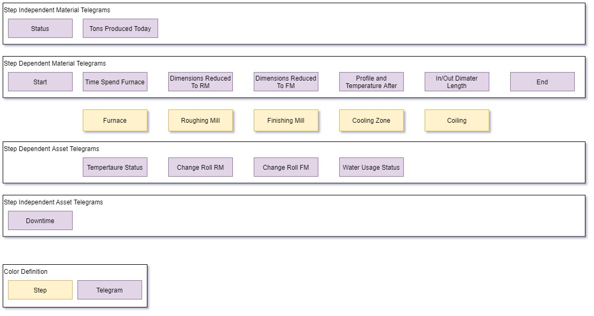
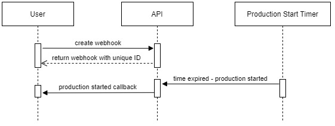

## Steel production API to simulate communication of a Hot Strip Mill.

[Check Docs](#docs) | [Create an issue](https://github.com/FirsovG/hsm-api/issues/new)

## Planned Functionality

## Roadmap by functionality

The functionality will be implemented in the order listed below.

### Required

- [x] Production Start
- [ ] Production End
- [ ] Production Status
- [ ] Downtime
- [ ] Furnace Time Spend

### Nice to have

- [ ] Furnace Tempertaure Status
- [ ] Roughing Mill Dimensions Reduced To
- [ ] Finishing Mill Dimensions Reduced To
- [ ] Water Usage Status
- [ ] Profile Temperature After
- [ ] Diamter And Length
- [ ] Roughing Mill Change Roll
- [ ] Finishing Mill Change Roll

## Docs

### Production Start

## License

HSM API is made available under the [MIT License](https://github.com/FirsovG/hsm-api/blob/main/LICENSE).
